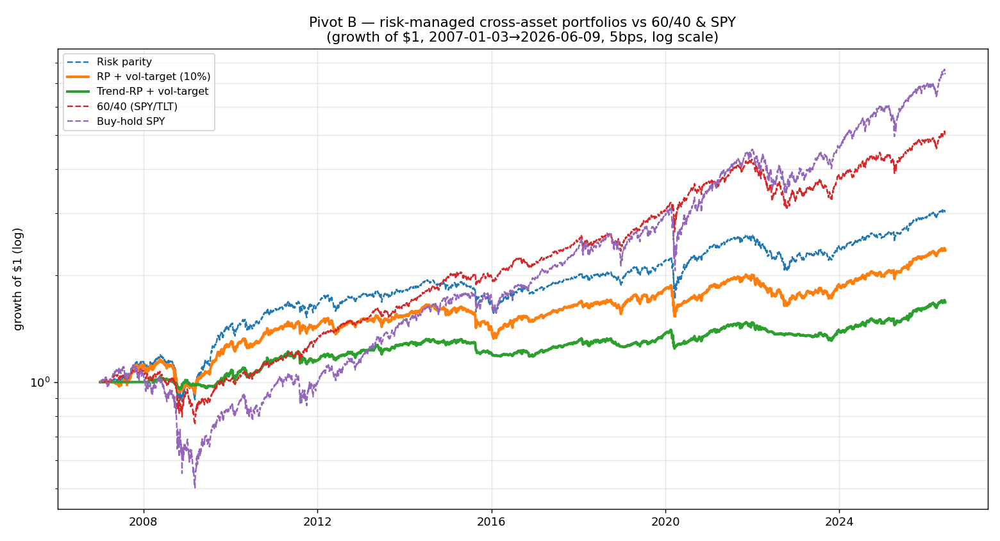

# Risk-managed portfolio v1 (Pivot B)

Regenerate with `python scripts/build_risk_managed_portfolio.py`.

**Setup:** cross-asset ETF universe (12 ETFs: US/intl equity, the Treasury curve, credit,
TIPS, gold, commodities), 2007-01 → present, 5 bps, monthly rebalance, look-ahead-safe.

| portfolio | Sharpe | annRet | annVol | maxDD | Calmar | turnover |
|---|---|---|---|---|---|---|
| 60/40 (SPY/TLT) | **0.78** | 8.7% | 11.5% | −30% | 0.29 | 0.00 |
| Buy-hold SPY | 0.62 | 10.9% | 19.6% | −55% | 0.20 | 0.00 |
| Risk parity | 0.59 | 5.9% | 10.7% | −27% | 0.22 | 0.015 |
| RP + vol-target (10%) | 0.54 | 4.5% | 8.9% | −20% | 0.23 | 0.015 |
| **Trend-RP + vol-target** | 0.48 | 2.7% | 5.9% | **−11%** | 0.24 | 0.030 |

## Honest findings
- **Nothing beats 60/40 on Sharpe over 2007–2026** — but that window is the *single best
  environment 60/40 will ever see*: a once-in-history bond bull (10y yield ~5% → ~0%) gave its
  40% Treasury sleeve a huge, **unrepeatable** tailwind. Judging risk-managed portfolios by
  Sharpe on exactly this window stacks the deck.
- **The real product is drawdown control.** The trend-overlay portfolio cut max drawdown to
  **−11%** — through both 2008 (SPY −55%) *and* 2022 (when 60/40 fell ~−30% as stocks and
  bonds dropped together). That regime-robustness is the genuine, repeatable value.
- **Broad diversification was a drag here, honestly.** EM, developed-ex-US, and commodities
  underperformed 2011–2020, pulling risk-parity below 60/40. This is real — global
  diversification costs you in a US-equity + US-bond bull, and pays off in other regimes.
- **Vol-targeting added less than it did on SPY.** The base portfolio already sits near 10%
  vol, so a 10% target (capped at 1×) mostly *de-levers* — trimming return without much Sharpe
  gain. Leverage is Sharpe-neutral, so it can't close the gap either; the gap is the
  diversifiers, not the sizing.

## What this means
This is the project's recurring lesson at the portfolio level: **we can reliably control risk,
not manufacture return.** A capital-preservation investor would rationally prefer the −11%
trend portfolio's ride over SPY's −55%; a total-return investor would not, on this window.
Neither is "wrong" — they're different objective functions, stated honestly.

## Next steps (not data-torture)
1. **Sleeve combination:** once we have >1 *validated* strategy, blend them with
   `combine_sleeves` (the equity vol-target sleeve + the cross-asset RP sleeve) — diversifying
   across *strategies*, not just assets.
2. **Regime-aware allocation** keyed off FRED macro (rate trend, credit spreads, yield curve)
   — lean into bonds only when the rate regime supports it, avoiding the 2022 trap.
3. **Report a capital-preservation objective** (Calmar / Ulcer / CVaR), not just Sharpe, so the
   drawdown win is scored on its own terms.
4. **Point-in-time single-name universe** (Pivot A, Tier 0) to add an honest equity-factor sleeve.

*Research artifact — not investment advice. Single backtest window; past performance is not
indicative of future results.*
