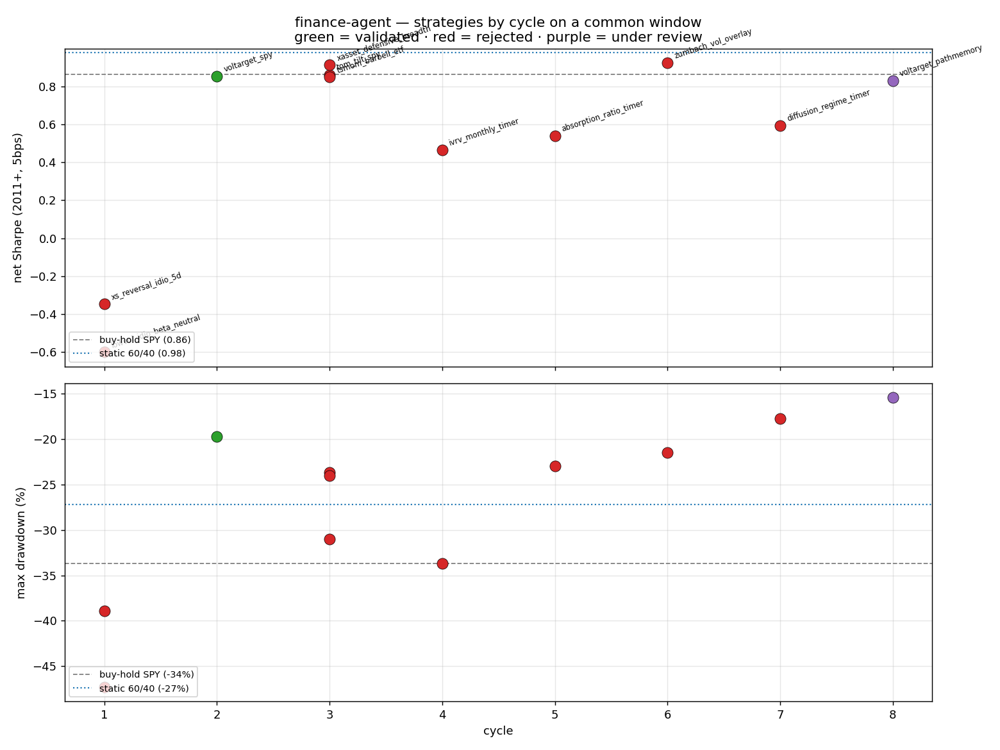

# Progress — cycle-by-cycle metrics

Regenerate with `python scripts/plot_cycle_trends.py` (writes the PNG + JSON).

**Comparability:** every strategy is re-run on ONE common, fully-warmed-up window
(**2011-01-01 → present, 5 bps**) so Sharpe/drawdown are directly comparable — the per-cycle
eval JSONs used different spans. Baselines on the same window: buy-hold SPY **Sharpe 0.86 /
maxDD −34%**, static 60/40 **0.98 / −27%**.

| cycle | strategy | Sharpe | maxDD | status |
|---|---|---|---|---|
| 1 | xs_reversal_idio_5d | −0.35 | −47% | rejected |
| 1 | lowvol_idio_beta_neutral | −0.60 | −39% | rejected |
| 2 | **voltarget_spy** | **0.85** | **−20%** | **validated** |
| 3 | xasset_defensive_breadth | 0.91 | −24% | rejected |
| 3 | tsmom_barbell_etf | 0.85 | −24% | rejected |
| 3 | tom_tilt_spy | 0.86 | −31% | rejected |
| 4 | ivrv_monthly_timer | 0.46 | −34% | rejected |
| 5 | absorption_ratio_timer | 0.54 | −23% | rejected |
| 6 | zumbach_vol_overlay | 0.92 | −22% | rejected |
| 7 | diffusion_regime_timer | 0.59 | −18% | rejected |
| 8 | voltarget_pathmemory | 0.83 | **−15%** | under review |

## How to read it (important)
- **Red ≠ "bad Sharpe."** On this benign 2011+ window (no GFC) several *rejected* strategies
  post fine Sharpe (zumbach 0.92, xasset 0.91). They were rejected for failing the **right
  tests** — VIX-redundancy (absorption), the leverage-effect-not-Zumbach decomposition
  (zumbach), losing to their honest benchmark / 60-40 (xasset, tsmom, tom), or no directional
  skill (ivrv) — *not* for a low number on one lucky window. The discipline is "beat the
  right baseline with honest standard errors," not "post a big in-sample Sharpe."
- **The real signal is in the drawdown panel.** The two vol-target strategies
  (`voltarget_spy`, `voltarget_pathmemory`) sit clearly below everything on max drawdown
  (−20%, −15% vs SPY −34%) — risk control is where this program has actually added value.
  `voltarget_pathmemory` (cycle 8, the first novel-combination build) has the **best drawdown
  of all** and is under red-team review.
- **Trend across cycles:** cycle 1 ideas were genuinely bad (negative Sharpe); from cycle 2
  on, ideas cluster near SPY but the bar (beat 60/40 / the incumbent on the right test) keeps
  most out. Progress is measured less by "higher Sharpe" than by *one validated strategy + a
  validated orthogonal signal (H_z) + a tightening methodology*.

*Research artifact — not investment advice. Single benign window shown for comparability;
see per-cycle reports and `runs/` for full-sample + crisis numbers.*
